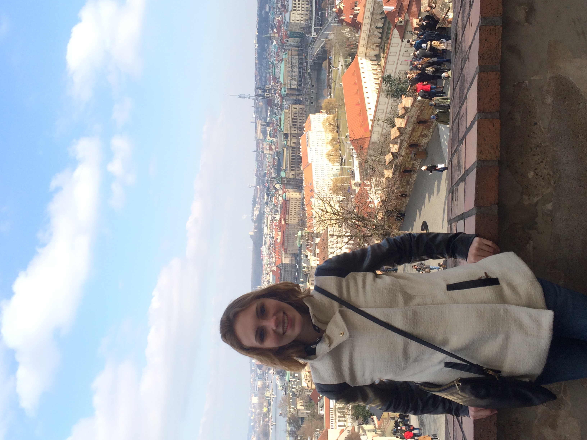

# Alena Howe's Portfolio
This is my public portfolio for CMU's Telling Stories with Data course.

# About me
Hello, I'm a second-year Master of Arts Manangement candidate at Heinz College. I use she/her pronouns. I'm excited to be taking Telling Stories with Data this fall. 

A little bit about myself...

Growing up in a family of art lovers and artists helped me develop an interest in exploring museums, learning about art history, and engaging in my local arts community. Since the third grade, I have taken wheel-thrown pottery classes at local art studios. I took my interests in ceramics and art history to Penn State, where I completed degrees in art history and French and worked as the campus’ public ceramics studio manager for four years. During that time, I also studied abroad in Paris, France and completed five internships in the arts, notably two internships at the Philadelphia Museum of Art. 

After graduating from Penn State, I moved to Washington, D.C. to work at a lighting design and museum design firm called George Sexton Associates. While that job challenged me, the firm’s museum projects reminded me that my passion was in the nonprofit arts sector, not the for-profit world. This realization led me to enroll in Heinz College’s Master of Arts Management (MAM) program. Now in my second year in the MAM program, I’m looking to apply my skills in database management, financial analysis, and communications to a career in fundraising at a visual arts museum. My goal is to move back to D.C. after graduation to work as a fundraiser at one of the Smithsonian Institution’s museums. 

When I’m not working or studying, I enjoy working out, visiting museums, and reading. Some of the books that I’ve read recently include Dracula, Middlesex, the Rape of Europa, among many others. I also enjoy watching classic/old movies, such as Hitchcock films, as well as foreign films (to brush up on my dwindling French skills).  

# What I hope to learn
In the nonprofit arts field, we excel at telling impactful stories about how art changes the lives of our visitors and community members. But we often struggle to obtain the quantitative data needed to support those stories. When robust quantitative data exists, museum professionals often lack the skills, time, and resources to interpret the data and create meaningful data visualizations. 

My goal for this course is to learn how to tell a compelling story given limited data and tools. I’m looking forward to learning about free, online resources that exceed Excel’s data visualization capabilities. I love Excel, but its charts are boring. I hope to develop a more critical eye for determining what is a good chart and then have the skills to make a better one. I also want to have a professional looking final project that I can show to prospective employers and link to my LinkedIn page. 

# Portfolio
This is where my data visualizations will go.
